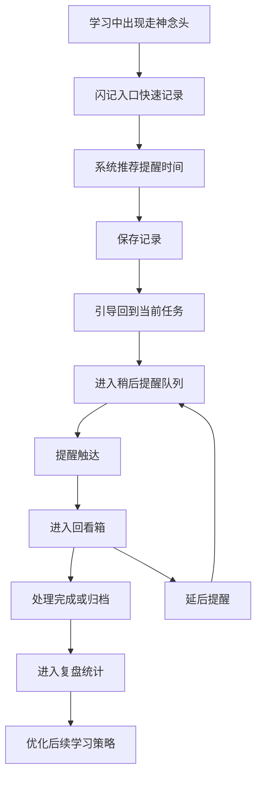
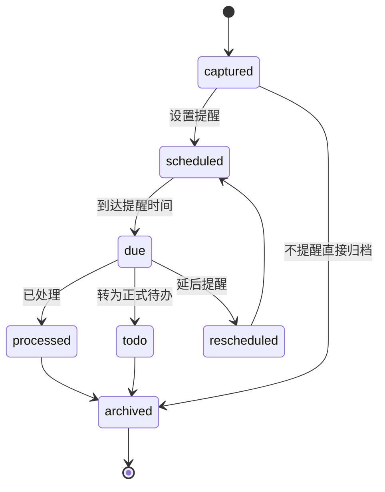

# 用户故事与核心流程

## 核心设计原则

围绕学习中的走神记录，产品必须满足四个原则：

- 记录动作足够快，不能打断当前学习任务

- 每条记录都有一个可预期的回看时间

- 记录完成后要明确引导用户返回当前任务

- 用户能在回看时快速处理，而不是进入新的复杂整理

## 核心用户故事

### 故事 1：刷题时突然想到别的任务

作为一名正在刷题的学生，
当我突然想到“下周实验报告还没写”，
我希望能在 3 秒内记下这件事并设置晚上提醒，
这样我就能放心继续做题，而不是马上切出去查资料。

### 故事 2：背书时冒出待查问题

作为一名正在背诵知识点的学生，
当我突然产生“这个概念我之后要再查一下”的念头，
我希望把它标记为“待查”，并在当前番茄钟结束后统一回看，
这样我就不会因为查一个问题引发连续分心。

### 故事 3：学习中冒出情绪或灵感

作为一名备考中的学生，
当我突然想起一件担忧、灵感或自我提醒，
我希望先快速存起来，
让自己获得“不会丢”的安全感，再回到学习中。

### 故事 4：晚间统一处理白天的走神记录

作为一名有复盘习惯的学生，
我希望在约定时间收到提醒并快速处理今天的记录，
把它们转成待办、归档或标记完成，
避免这些未处理事项继续占用心理带宽。

## 核心闭环

## 关键流程拆解

### 流程 A：学习中快速记录

目标：用户在不离开专注状态太久的前提下完成捕捉。

步骤：

1. 用户在学习页点击 `记一下`。

2. 底部弹出闪记层，自动聚焦输入框。

3. 用户输入一句话，或直接语音输入。

4. 系统展示快捷时间选项：`15 分钟后`、`番茄钟后`、`今晚 20:00`、`自定义`。

5. 用户点击一个时间后立即保存。

6. 页面显示“已记下，先回来吧”，并自动返回学习页。

设计要点：

- 默认最少输入字段只有“内容”

- 尽可能避免多步表单

- 保存成功反馈不能过强，以免再次打断

### 流程 B：到点提醒后回看处理

目标：让用户在提醒触达后快速消化掉挂起事项。

步骤：

1. 系统在约定时间推送提醒。

2. 用户点击进入 `回看箱`。

3. 默认展示到期未处理记录，按时间排序。

4. 用户可对每条记录执行以下操作：

   - `已处理`
   - `转待办`
   - `再提醒`
   - `归档`
   - `补标签`

5. 处理完成后，列表减少，用户获得“已清空”的轻反馈。

设计要点：

- 单条处理动作不超过 2 次点击

- 默认优先帮助用户清空，而不是精细管理

- 所有动作都应可快速批处理或滑动完成

### 流程 C：专注复盘

目标：把走神记录升级为长期可分析的注意力数据。

步骤：

1. 用户进入统计页查看今日或本周表现。

2. 系统呈现走神次数、时间段、类型和任务关联。

3. 用户看到高频模式，如“晚上 9 点后更容易出现手机相关分心”。

4. 产品给出轻量建议，帮助用户优化环境或任务安排。

## 核心状态机

从数据层面看，一条记录应经历以下状态：

## 最小交互对象

为了支撑核心闭环，每条走神记录至少需要这些字段：

- `content`：记录内容

- `createdAt`：记录时间

- `contextTask`：所在学习任务

- `remindAt`：回看时间

- `type`：杂念、待查、任务、情绪、灵感

- `status`：待提醒、待处理、已处理、已归档

## 失败路径与补救策略

### 1. 用户嫌记录太麻烦

补救：

- 默认只保留一句话输入

- 支持语音转文字

- 提供常用快捷提醒时间

### 2. 用户记录了但不回看

补救：

- 提醒文案突出“清空挂起事项”

- 回看页默认仅显示到期内容

- 支持一键清空或快速归档

### 3. 用户记录后继续发散

补救：

- 保存后自动收起弹层

- 显示轻提示“先继续当前任务”

- 学习页保留当前任务和番茄钟状态，降低跳出感

## 关键体验指标

为了验证核心流程是否成立，首版应重点观察：

- 从点击 `记一下` 到保存成功的平均时长

- 记录后 10 秒内返回学习页的比例

- 到点提醒后的打开率

- 回看箱内单条记录的平均处理时长

- 被反复延后的记录比例
