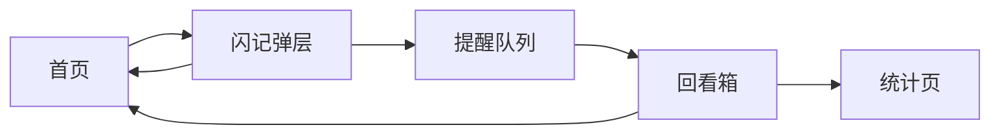

# 关键页面原型说明

本文档输出第一版最关键的 3 个页面方案：

- 首页

- 闪记弹层

- 回看箱

目标不是高保真视觉设计，而是明确页面结构、关键信息、核心操作和交互优先级。

## 1. 首页

### 首页目标

- 承接用户进入 App 的第一视图

- 快速开始学习

- 在学习中随时记录走神念头

- 呈现“今天还有哪些念头待回看”

### 首页结构

```text
------------------------------------------------
[顶部问候]
下午好，正在准备什么？

[当前任务卡片]
任务：高数刷题
状态：专注中 / 未开始
按钮：[开始专注] [结束专注]

[番茄钟模块]
25:00
[开始] [暂停] [重置]

[主操作区]
[记一下]  <- 最高优先级按钮

[今日待回看]
还有 3 条念头待处理
- 晚上查一下电场公式
- 记得交英语作业
- 想买新的耳机
[查看全部]

[底部导航]
首页 | 回看箱 | 统计 | 我的
------------------------------------------------

```

### 关键元素说明

#### 当前任务卡片

作用：

- 给用户一个明确的“当前主线”

- 记录完成后便于回到这个主线

字段建议：

- 任务名称

- 当前状态

- 已专注时长

#### `记一下` 按钮

作用：

- 全页面最重要的入口

交互建议：

- 固定在页面视觉中心或底部悬浮

- 单手操作范围内

- 点击后直接弹出闪记层

#### 今日待回看

作用：

- 提醒用户这不是一次性记录工具，而是有后续处理闭环

交互建议：

- 展示数量和最近 2-3 条内容

- 点击进入回看箱

### 首页交互原则

- 用户打开 App 后，3 秒内能找到记录入口

- 首页的信息层级应服从“当前任务 > 快速记录 > 待回看”

- 不展示复杂设置，不让首页像仪表盘

## 2. 闪记弹层

### 闪记目标

- 在最短时间完成记录和提醒设置

- 让用户几乎不离开当前学习节奏

### 闪记结构

```text
------------------ 闪记弹层 -------------------
标题：记一下，稍后处理

[输入框]
把刚刚想到的内容记下来...

[语音输入按钮] [清空]

[快捷提醒]
( ) 15 分钟后
( ) 番茄钟后
( ) 今晚 20:00
( ) 睡前
( ) 自定义

[快捷标签]
杂念  待查  任务  情绪  灵感

[底部按钮]
[取消]                     [保存并回去]
------------------------------------------------

```

### 默认交互流程

1. 用户点击首页 `记一下`。

2. 弹层从底部上滑。

3. 光标自动聚焦输入框。

4. 用户输入一句话。

5. 用户点击一个快捷提醒时间。

6. 点击 `保存并回去`。

7. 弹层关闭，回到首页或学习态。

### 优化建议

#### 默认推荐提醒

系统可根据当前场景优先展示：

- 专注中：优先 `番茄钟后`

- 晚间：优先 `今晚`

- 非专注场景：优先 `15 分钟后`

#### 文案反馈

保存成功后，给一条轻反馈即可：

- 已记下，先回来吧

- 稍后会提醒你

不要使用强提示音或复杂动画。

### 异常情况处理

- 用户没填内容：禁用保存按钮

- 用户未选提醒时间：给出默认值 `15 分钟后`

- 语音识别失败：保留文本输入，不打断用户

## 3. 回看箱

### 回看箱目标

- 集中回收所有到期或挂起的走神记录

- 帮助用户快速做出处理决策

- 降低心理挂起感

### 回看箱结构

```text
------------------- 回看箱 ---------------------
顶部筛选：全部 | 到期 | 待处理 | 已延后

[提示条]
今天有 4 条念头等你处理

[记录卡片 1]
内容：下周把实验报告大纲列一下
来源：高数刷题
时间：今天 14:20 记录 / 20:00 提醒
标签：任务
[已处理] [转待办] [延后] [归档]

[记录卡片 2]
内容：查一下“边际效应递减”
来源：政治背诵
时间：今天 16:10 记录 / 番茄钟后提醒
标签：待查
[已处理] [转待办] [延后] [归档]

[底部快捷操作]
[全部已处理] [清空已归档]
------------------------------------------------

```

### 记录卡片字段

每条记录建议包含：

- 内容

- 记录时所在任务

- 创建时间

- 提醒时间

- 类型标签

- 快捷动作

### 快捷动作定义

#### 已处理

语义：

- 我已经处理过了，不需要再次提醒

结果：

- 状态变为已处理

- 从默认待处理列表移除

#### 转待办

语义：

- 这是正式事项，不适合继续留在走神箱中

结果：

- 生成一条正式待办

- 原记录标记为已转化

#### 延后

语义：

- 现在还不处理，但要在之后再次出现

结果：

- 弹出快捷时间选项

- 更新提醒时间

#### 归档

语义：

- 留存记录，但不再参与当前提醒

结果：

- 状态变为已归档

### 交互建议

- 支持卡片左滑快速归档，右滑已处理

- 优先显示到期项，减少列表选择成本

- 当列表清空时，展示轻松的完成态

空状态文案示例：

- 今天的念头已经清空了

- 没有待处理内容，继续专注吧

## 三页之间的关系



## 页面优先级结论

如果只能先设计 3 个页面，应按以下顺序推进高保真原型：

1. 闪记弹层

2. 首页

3. 回看箱

原因：

- 闪记弹层决定产品是否真的“足够轻”

- 首页决定记录之后是否容易回到当前任务

- 回看箱决定提醒是否能形成真正闭环
