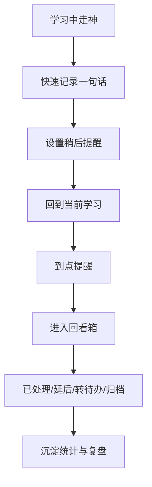

# PRD 初稿：走神记录 App

## 1. 产品概述

### 1.1 产品名称

暂定名：Focus

备选名：

- `先记下`
- `念头寄存`

### 1.2 产品定位

一款面向学生的学习中断管理 App，帮助用户在学习中快速记录走神念头、约定稍后提醒，并在合适时间统一处理，减少由“怕忘”和“顺手展开”带来的专注损耗。

### 1.3 目标用户

- 备考型学生
- 课程学习型学生
- 高压复习型学生

### 1.4 核心价值

- 降低学习中断成本
- 帮助用户快速回到当前任务
- 将走神内容变成可回收、可复盘的数据

## 2. 问题定义

用户在学习时经常出现瞬时念头，例如：

- 想起一个待办
- 想查一个问题
- 想回复一条消息
- 想到一个灵感或担忧

如果当下处理，会引发连续分心；如果不处理，又担心忘记。现有待办或备忘录工具记录过重，无法适配高频、低时长、强专注的学习场景。

## 3. 产品目标

### 3.1 首版目标

验证学生是否愿意使用一个“超轻量记录 + 稍后回看”的工具来管理学习中的走神。

### 3.2 成功指标

- 单次记录平均耗时低于 5 秒
- 记录后返回学习页比例高
- 到点提醒后的处理率达到可用水平
- 用户能在统计页识别自己的高频走神模式

## 4. 产品范围

### 4.1 首版必须包含

- 首页
- 闪记弹层
- 稍后提醒
- 回看箱
- 基础统计

### 4.2 首版明确不做

- 社交自习室
- 学习社区
- AI 长对话陪伴
- 复杂课程表整合
- 长文笔记系统

## 5. 核心流程

## 6. 功能需求

### 6.1 首页

目标：

- 作为用户的学习主场景入口
- 提供快速记录与待回看概览

核心模块：

- 当前学习任务
- 番茄钟
- `记一下` 主按钮
- 今日待回看概览

### 6.2 闪记弹层

目标：

- 在极短时间内完成念头捕捉

功能点：

- 文本输入
- 语音转文字
- 快捷提醒时间
- 快捷标签
- 保存并返回学习页

### 6.3 稍后提醒

目标：

- 确保每条记录都有未来处理机会

支持方式：

- 15 分钟后
- 番茄钟后
- 今晚固定时间
- 自定义时间

### 6.4 回看箱

目标：

- 统一处理到期记录

功能点：

- 待处理列表
- 已处理
- 转待办
- 延后提醒
- 归档

### 6.5 统计页

目标：

- 让用户形成持续使用动机

功能点：

- 今日/本周记录次数
- 类型分布
- 时间分布
- 高频分心模式提示

## 7. 数据对象

### 7.1 走神记录

字段建议：

- `id`
- `content`
- `createdAt`
- `contextTask`
- `remindAt`
- `type`
- `status`

### 7.2 状态定义

- 待提醒
- 待处理
- 已处理
- 已归档
- 已转待办

## 8. 核心交互要求

- 从点击 `记一下` 到保存完成，目标时长小于 5 秒
- 保存完成后必须明确引导用户返回当前任务
- 回看箱中单条操作不超过 2 次点击
- 所有页面风格应以轻量、安静、低打扰为原则

## 9. 风险与假设

### 9.1 关键假设

- 学生愿意在学习中使用独立工具记录走神
- 稍后提醒比“先记在备忘录里”更能形成闭环
- 复盘统计能提升用户留存

### 9.2 主要风险

- 用户觉得多打开一个 App 仍然太重
- 提醒太多会变成新的干扰
- 回看动作没有形成习惯，导致记录堆积

## 10. 后续版本方向

- AI 自动分类记录内容
- AI 推荐提醒时间
- 与课程表或考试日程联动
- 更细的注意力画像与建议

## 11. 交付物索引

本次已产出以下文档：

- `01_产品定位与命名方向.md`
- `02_用户故事与核心流程.md`
- `03_MVP功能清单.md`
- `04_关键页面原型说明.md`
- `05_PRD初稿.md`

