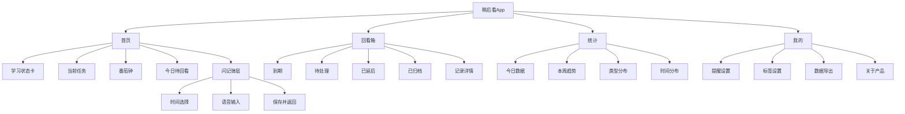
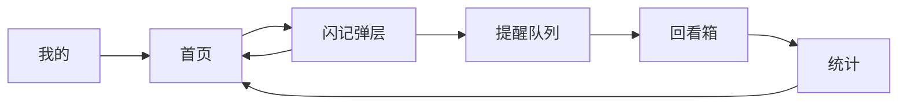
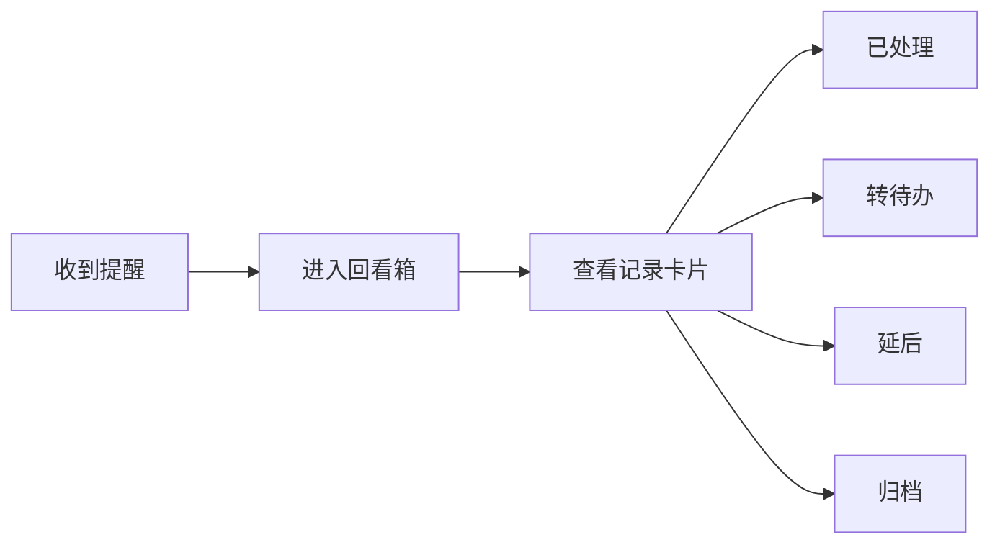
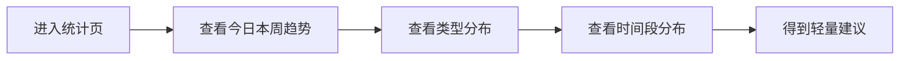

# App 信息架构

本文档基于 `05_PRD初稿.md` 与 `04_关键页面原型说明.md`，将产品从概念方案推进到可执行的信息架构层。

目标是明确：

- App 的导航结构
- 页面层级关系
- 核心信息对象
- 关键任务路径
- 页面职责边界

## 1. 架构原则

本产品的信息架构必须服务于“学习中低打扰记录”这一核心场景，因此遵循以下原则：

- 主路径尽可能短，核心操作不超过 2 层
- 记录入口必须在全局高可达
- 信息分类先轻后重，先记录再整理
- 提醒与回看要形成天然闭环，而不是孤立列表
- 统计服务于复盘，不挤占首页主任务空间

## 2. 一级导航结构

首版建议采用 `底部 Tab + 全局悬浮闪记入口 + 局部弹层` 的组合。

### 一级导航

- 首页
- 回看箱
- 统计
- 我的

### 全局快捷入口

- `记一下`：全局悬浮按钮，任一主页面都可触发闪记弹层

## 3. 站点地图

## 4. 页面层级定义

### 4.1 首页

页面职责：

- 承载当前学习上下文
- 提供最快的记录入口
- 让用户看到今日待回看概况

主要内容层级：

1. 当前学习任务
2. 番茄钟状态
3. `记一下` 主入口
4. 今日待回看摘要

不应承载：

- 复杂统计图表
- 过多历史记录
- 大量设置入口

### 4.2 回看箱

页面职责：

- 统一承接到期或待处理记录
- 支持快速清空挂起事项
- 作为“提醒触达后的默认落点”

主要内容层级：

1. 到期记录
2. 待处理记录
3. 单条快捷动作
4. 延后与归档操作

不应承载：

- 长篇编辑
- 复杂项目管理

### 4.3 统计

页面职责：

- 呈现行为结果
- 帮助用户识别自己的走神模式
- 形成长期留存理由

主要内容层级：

1. 今日走神概况
2. 本周趋势
3. 标签分布
4. 时间段分析
5. 轻量建议

### 4.4 我的

页面职责：

- 承载偏设置型与低频操作
- 隔离与主学习流程无关的信息

主要内容层级：

1. 提醒设置
2. 标签设置
3. 数据导出
4. 帮助与关于

## 5. 全局入口与跨页关系

### 全局入口

`记一下` 是产品的全局高频入口，建议具备以下特性：

- 首页中作为视觉主按钮出现
- 其他一级页面中以悬浮按钮出现
- 可中断当前浏览流程，但不应中断已有学习计时状态

### 跨页关系

核心逻辑：

- 首页负责“开始和返回”
- 回看箱负责“处理和清空”
- 统计负责“看见模式”
- 我的负责“配置系统”

## 6. 核心信息对象

### 6.1 走神记录 `Note`

这是产品最核心的信息对象。

字段建议：

- `id`
- `content`
- `createdAt`
- `updatedAt`
- `status`
- `type`
- `remindAt`
- `sourcePage`
- `contextTask`
- `isVoiceInput`

说明：

- `content`：用户记录的一句话内容
- `status`：记录的生命周期状态
- `type`：杂念、待查、任务、情绪、灵感
- `contextTask`：记录发生时的学习任务

### 6.2 学习任务 `StudyTask`

用于给每次记录提供上下文，不需要首版做成复杂任务系统。

字段建议：

- `id`
- `title`
- `subject`
- `status`
- `startedAt`
- `endedAt`

### 6.3 学习会话 `StudySession`

用于统计当前专注时长、走神次数和记录归属。

字段建议：

- `id`
- `taskId`
- `startedAt`
- `endedAt`
- `pomodoroDuration`
- `noteCount`

### 6.4 提醒项 `Reminder`

用于驱动稍后处理机制。

字段建议：

- `id`
- `noteId`
- `triggerAt`
- `triggerType`
- `status`

## 7. 状态体系

建议将记录状态统一控制为以下 5 类：

- `draft`：暂存未保存
- `scheduled`：已设置提醒，等待到点
- `due`：已到提醒时间，待处理
- `processed`：已处理完成
- `archived`：已归档

可选扩展状态：

- `converted`：已转待办
- `snoozed`：已延后，等待新提醒

## 8. 关键任务路径

### 路径 A：学习中快速记录

设计要求：

- 该路径必须是全产品最短路径
- 不应要求用户先建任务、先选分类、先做设置

### 路径 B：提醒后回看处理

设计要求：

- 提醒点击后默认直达“到期”筛选
- 所有处理动作都应保持轻量

### 路径 C：复盘

## 9. 信息优先级

为保证低打扰体验，各页面应遵循以下信息优先级。

### 首页优先级

1. 当前任务
2. `记一下`
3. 番茄钟
4. 今日待回看

### 回看箱优先级

1. 到期记录
2. 单条处理动作
3. 过滤筛选
4. 历史归档

### 统计页优先级

1. 今日次数
2. 本周趋势
3. 类型分布
4. 时间分布
5. 解释性建议

## 10. 权限与系统能力

首版需要规划但不必全部深做的系统能力包括：

- 通知权限：用于到点提醒
- 麦克风权限：用于语音转文字
- 本地存储或账号存储：用于记录历史

首版建议：

- 默认以本地记录为主
- 首次使用时再引导开启通知
- 语音能力作为增强选项，不阻塞主流程

## 11. 信息架构结论

首版应坚持一个非常清晰的结构：

- 用 `首页` 承接学习场景
- 用 `闪记弹层` 承接高频输入
- 用 `回看箱` 承接提醒后的处理
- 用 `统计` 提供长期留存理由
- 用 `我的` 隔离设置项

如果后续进入原型或开发阶段，这份架构可以直接作为：

- 页面清单
- 导航设计依据
- 数据模型初版
- 用户流拆解依据
